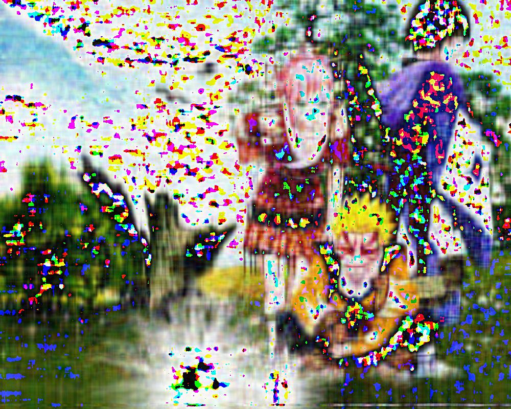
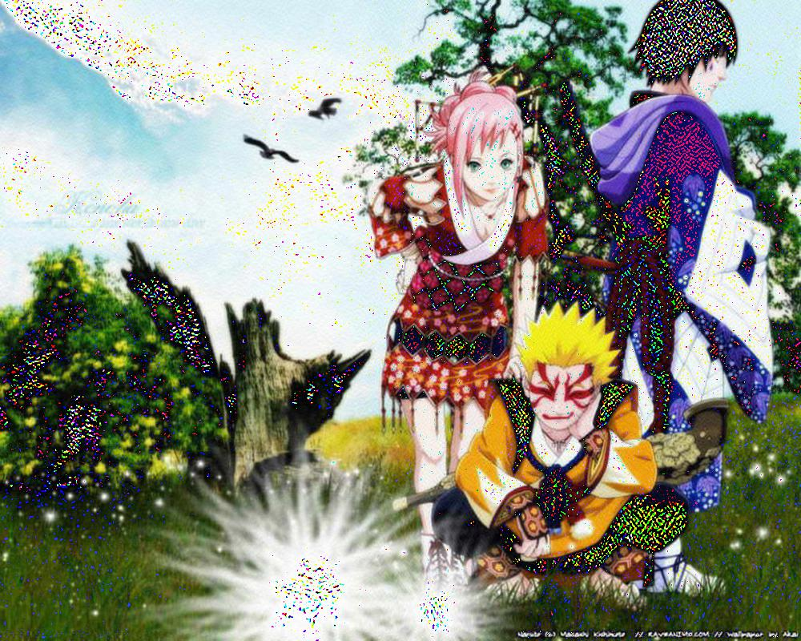

UECM3033 Assignment #2 Report
========================================================

- Prepared by: ** Tan Hong Wee**
- Tutorial Group: T3

--------------------------------------------------------

## Task 1 --  $LU$ Factorization or SOR method

The reports, codes and supporting documents are to be uploaded to Github at: 

[https://github.com/TanHongWee/UECM3033_assign2](https://github.com/TanHongWee/UECM3033_assign2)

Explain your selection criteria here.

-The condition is set to be np.count_nonzero(A) > 1/2*len(A). Sparse matrix is a matrix where most of the elements are zeros, so in this case, if the nonzeros is greater that half of the length of matrix A then we will choose LU method. Iterative methods, which consist of SOR method are well-suited for sparse matrix.

Explain how you implement your `task1.py` here.

 -In task 1 , self define function of lu, sor and solve are created. For LU method, two   matrix will be created : the lower matrix and upper matrix , A=LU, then Ax=LUx=b, so Ly=b and Ux= y.The x matrix will be get after getting the y matrix. 

 -For the SOR method, omega is assumed to be 1.03 which is within the range of 1<omega<2 that will converge for any initial vector if A matrix is symmetric and positive definite. If omega is greater than 2 , SOR method will diverge. If 0 < omega<1, SOR method converges but the convergence rate is slower than the Gauss-Seidal method. 

 -After that , the iteration limit also needed to be set so that it will not loop until infinity time. In this task, the iteration limit is assumed to be 10. We start the iteration by assuming the first x is a zero vector. Then we will substitute each x we found to count the new x and iterate it until the iteration limit.

 -To find the exact answer, let the sol equal to np.linalg.solve(A,b) else the answer will not be true.
 
 -The solutions to the first set of 3-variables system of linear equations are
   [ 1.  1.  1.]
 
 -The solutions to the second set of 6-variables system of linear equations are 
   [ 1.  -1.   4.  -3.5  7.  -1. ]

To check the solutions of the system Ax=b, multiply A with x to verify that the answer is equals to b.
---------------------------------------------------------

## Task 2 -- SVD method and image compression

Put here your picture file (Image.jpg)

How many non zero element in $\Sigma$?

-The number of non zero elements in $\Sigma$ is equivalent to the number of rows in $\Sigma$ which is 800. More generally, the number of non zero elements in $\Sigma$ is equals to the height of our image in pixels.

Put here your lower and better resolution pictures. Explain how you generate
these pictures from `task2.py`.

LOWER RESOLUTION PICTURE 

 -First we split the original image into its red, green and blue components. For each of the component, we use the predefined linalg.svd() function from the numpy library to perform singular value decomposition. To create a lower resolution picture, input n=30 as an input parameter to the function reso(n,U,sigma,V) for all the rgb components . Only the first 30 singular values in $\Sigma$ are not replace with zeros. 
 
-Since a large amount of singular values are set to zeros, there will be a drop in the quality of the image. We can see this effect by merging the newly computed rgb channels to form a coloured image as shown above.

BETTER RESOLUTION PICTURE

 -For a better resolution picture, we input n=200 rather than n=30 as an input parameter to the predefined linalg.svd() function. Instead of only 30 singular values, we now have 200 singular values in $\Sigma$ that are not replace with zeros. 
 
 -Therefore, this image will be of better quality as shown above.

What is a sparse matrix?

-A sparse matrix is a matrix where most of the elements are zero. In image compression with SVD, our $\Sigma$ is the sparse matrix. 

-This is because $\Sigma$ is a diagonal matrix where all the elements are zero except for the diagonal. Hence, the sparse matrix in image compression with SVD has (N x M)-N zero elements where M and N are the width and the height of the image respectively.

-----------------------------------

last modified: 11 March 2016
